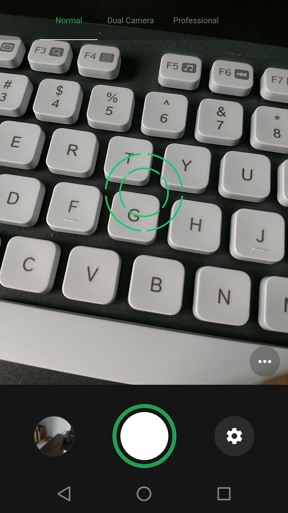
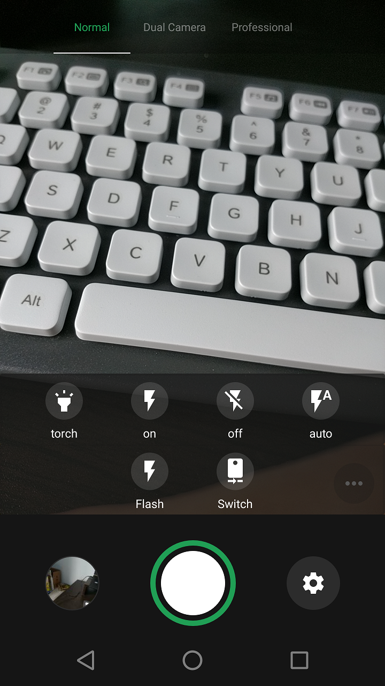
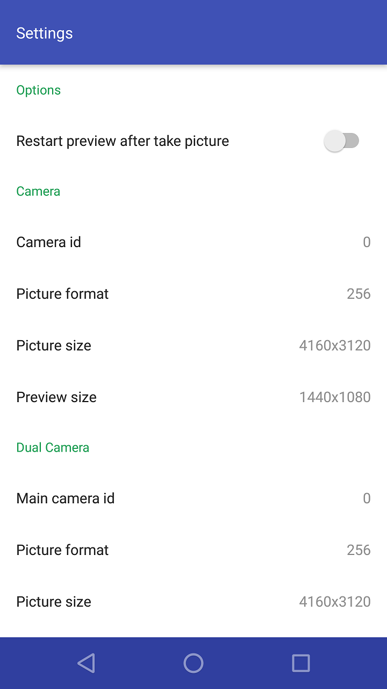
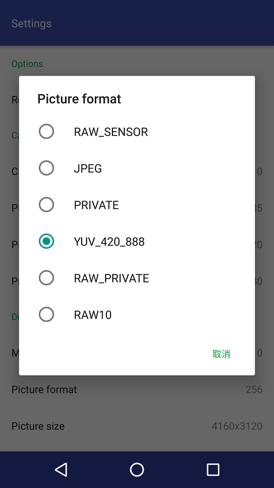

## Camera2

### No longer maintained

Camera App write with API 2

1. Can open two camera at the same time (if you phone support)

2. Can get yuv format picture(if support, can be seen in Settings), if is yuv file, no thumbnail will generated, file save path: "/sdcard/DCIM/Camera2/"

## ScreenShot

</img>
</img>
</img>
</img>

